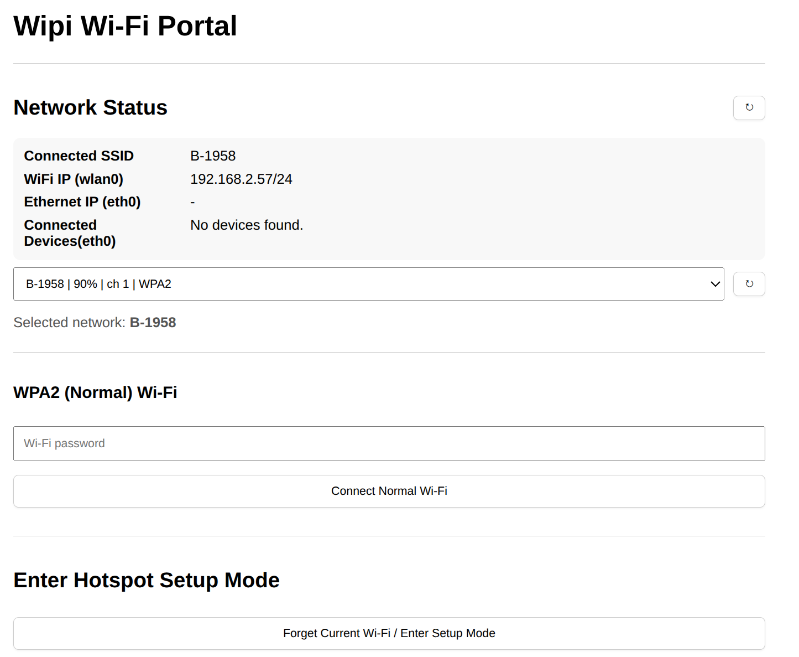

# wipi network gateway and portal

This project is aimed creating a light weight gateway from the raspberry pi's wireless network card to the ethernet port to provide internet access to routers (particularly for IOT projects).




### Network structure
``` bash
[Main WiFi Network]
        |
    (WiFi)
        |
   Raspberry Pi
   wlan0 -> internet
   eth0  -> shared LAN
        |
    Ethernet cable
        |
   Secondary Router
        |
   Devices
```

## Installation
### install.sh

```bash
git clone git@github.com:mohas95/wipi.git
cd wipi
chmod -x install.sh
sudo ./install.sh
# Follow instructions during installation
```

### Manual Installation 
```bash

git clone git@github.com:mohas95/wipi.git
cd wipi

python3 -m venv venv

source venv/bin/activate

pip install --upgrade -r requirements.txt

chmod +x setup-pi-ethernet-gateway.sh
sudo ./setup-pi-ethernet-gateway.sh

chmod +x autohotspot.sh
sudo ln -s /home/pi/wipi/wipi-autohotspot.service /etc/systemd/system/wipi-autohotspot.service

sudo ln -s /home/pi/wipi/wipi-portal.service /etc/systemd/system/wipi-portal.service

sudo systemctl daemon-reload
sudo systemctl enable wipi-autohotspot
sudo systemctl start wipi-autohotspot

sudo systemctl enable wipi-portal
sudo systemctl start wipi-portal

```

## Hotspot Information
- default hostname: wipi.local
- default ssid (hotspot mode): WipiSetup
- default psk: configureme123
- wipi configuration portal: http://< device ip address or hostname.local >